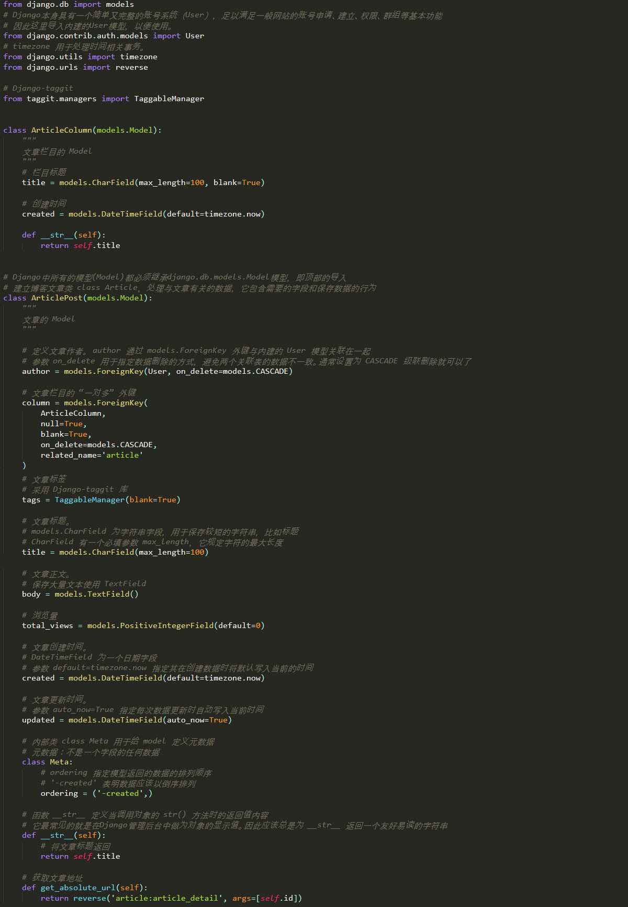
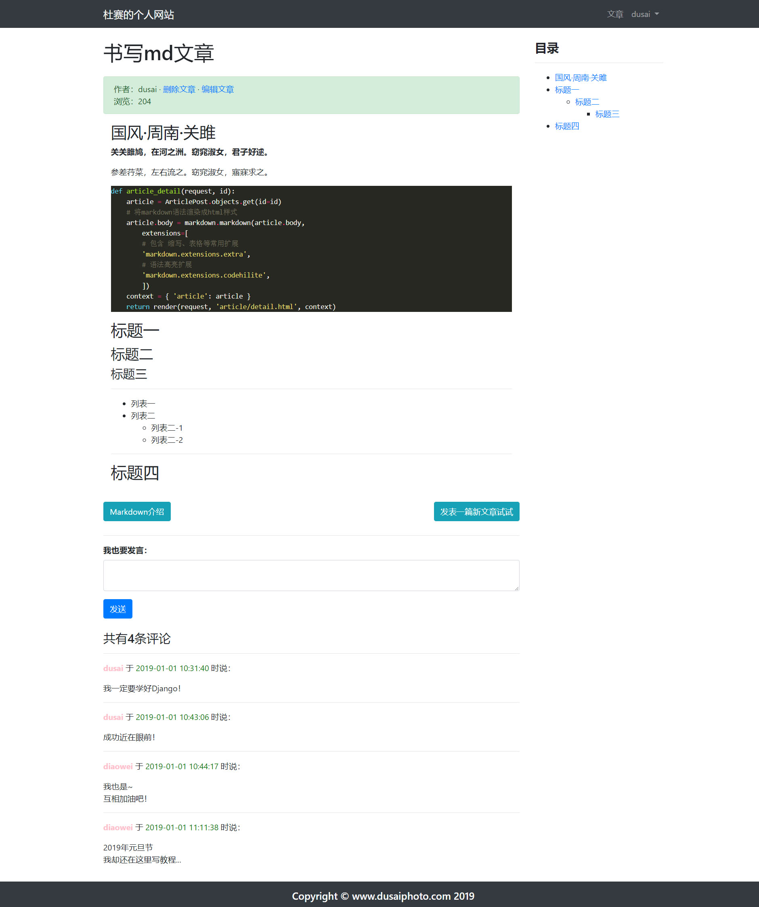

- 2023-08-30
  - 此仓库由stacklens大佬的[django_blog_tutorial](https://github.com/stacklens/django_blog_tutorial)fork而来。
这里我修改了md文件的链接，并离线保存了md里面的图片，防止原博客图床失效。

---

[](https://www.python.org/downloads/release/python-370/)
[](https://docs.djangoproject.com/en/2.1/releases/2.1/)
[](https://getbootstrap.com/docs/4.1/getting-started/introduction/)
[](https://creativecommons.org/licenses/by-nc/4.0/)

# Django搭建个人博客教程

这是面向新人的**Django搭建个人博客教程**的项目代码。

**教程为零基础的小白准备，目的是快速搭建一个博客网站。**

教程传送门：

- [GitHub](https://github.com/yst990102/django_blog_tutorial/tree/master/md)
- [个人博客](https://www.dusaiphoto.com/article/detail/2/)
- [知乎](https://www.zhihu.com/column/django-blog)

> 注：内容是完全相同的。

## 教程特点
- 零基础、免费、中文
- 基于最新的 Python 3.7、Django 2.2 和 Bootstrap 4 版本
- 完整项目代码，以及详细的注释

## 适合人群
- 拥有一台能开机的电脑
- 有一点点最基础的python编程知识
- 每天能抽出一个小时学习

不要犹豫，现在立刻开始Django的学习吧！

## 社区

**一个人的学习是孤单的。欢迎扫码 Django 交流QQ群（107143175）、博主公众号、TG群组，和大家一起进步吧！**


## 教程导航
**章节编号与GitHub仓库分支（Branch）编号是对应的。**

**01** - [前言](https://github.com/yst990102/django_blog_tutorial/blob/master/md/01.前言.md)

- Django 简介 / 资源列表 / 提问须知

**02** - [教程的开发环境](https://github.com/yst990102/django_blog_tutorial/blob/master/md/02.教程的开发环境.md)

- 环境简介 / 安装 Python / 配置虚拟环境
- 安装 Django / 创建 Django 项目 / 运行 Django 服务器
- 代码编辑器 / 浏览器选择

**03** - [创建 APP](https://github.com/yst990102/django_blog_tutorial/blob/master/md/03.创建app.md)

- 认识项目结构 / 注册 APP / 配置访问路径

**04** - [编写 Model](https://github.com/yst990102/django_blog_tutorial/blob/master/md/04.编写Model.md)

- Django 模式简介 / 模型简介
- 编写 Model / Model 字段分解
- 数据迁移

**05** - [View 视图初探](https://github.com/yst990102/django_blog_tutorial/blob/master/md/05.View视图初探.md)

- 第一个视图
- 网站后台概念 / 创建管理员 / 注册 app
- 检视数据库

**06** - [View 及 Template](https://github.com/yst990102/django_blog_tutorial/blob/master/md/06.View及Template.md)

- 改写视图函数
- 编写模板 / 错误分析
- Debug 工具

**07** - [使用Bootstrap改写模板](https://github.com/yst990102/django_blog_tutorial/blob/master/md/07.使用Bootstrap改写模板.md)

- 配置 Bootstrap 4
- 编写模板 / 模板继承

**08** - [编写文章详情页面](https://github.com/yst990102/django_blog_tutorial/blob/master/md/08.编写文章详情页面.md)

- 详情页面视图 / 详情页面模板
- 优化网页入口 / 参数传递

**09** - [使用Markdown书写文章](https://github.com/yst990102/django_blog_tutorial/blob/master/md/09.使用Markdown书写文章.md)

- 安装 Markdown
- 在视图中使用 Markdown / 模板渲染
- 代码高亮 / 故障排查 / 自定义样式

**10** - [发布新文章](https://github.com/yst990102/django_blog_tutorial/blob/master/md/10.发布新的文章.md)

- 表单类 / 处理创建请求 / 获取数据
- csrf_token / 模板中的表单 / 优化写文章入口

**11** - [删除文章](https://github.com/yst990102/django_blog_tutorial/blob/master/md/11.删除文章.md)

- get 方式删除文章 / post 方式删除文章
- 弹窗功能 / 再谈 CSRF

**12** - [更新文章](https://github.com/yst990102/django_blog_tutorial/blob/master/md/12.更新文章.md)

- 更新文章视图 / 编写模板 / url 和入口

**13** - [用户的登录和登出](https://github.com/yst990102/django_blog_tutorial/blob/master/md/13.用户的登录和退出.md)

- 用户管理简介 / 再谈表单类
- 登录视图 / Session 介绍 / 登录模板 / url 及其他设置
- 用户的登出

**14** - [用户的注册](https://github.com/yst990102/django_blog_tutorial/blob/master/md/14.用户的注册.md)

- 注册表单 /  注册视图 / 模板和 url

**15** - [用户的删除](https://github.com/yst990102/django_blog_tutorial/blob/master/md/15.用户的删除.md)

- 权限与视图 / 检查数据库

**16** - [重置用户密码](https://github.com/yst990102/django_blog_tutorial/blob/master/md/16.重置用户密码.md)

- 安装三方库 / 使用库
- 配置邮箱 / 常见错误

**17** - [拓展用户信息](https://github.com/yst990102/django_blog_tutorial/blob/master/md/17.拓展用户信息.md)

- 拓展 User / 重建数据库
- 表单、视图和模板 / 修改 article 视图 / 配置后台

**18** - [上传头像](https://github.com/yst990102/django_blog_tutorial/blob/master/md/18.上传头像.md)

- 必要配置 / 编写 MTV

**19** - [文章分页](https://github.com/yst990102/django_blog_tutorial/blob/master/md/19.文章分页.md)

- Paginator 类 / 分页视图 / 模板编写

**20** - [浏览量](https://github.com/yst990102/django_blog_tutorial/blob/master/md/20.浏览量.md)

- 修改模型 / 列表模板 / 详情模板 / 修改视图
- 鉴权

**21** - [最热文章](https://github.com/yst990102/django_blog_tutorial/blob/master/md/21.最热文章.md)

- 重构视图 / 修改模板及测试

**22** - [搜索文章](https://github.com/yst990102/django_blog_tutorial/blob/master/md/22.搜索文章.md)

- 搜索逻辑 / get 和 post 的区别 / Q对象
- 面包屑组件 / 搜索框

**23** - [文章目录](https://github.com/yst990102/django_blog_tutorial/blob/master/md/23.文章目录.md)

- 文章中的目录
- 任意位置的目录

**24** - [评论](https://github.com/yst990102/django_blog_tutorial/blob/master/md/24.评论.md)

- 创建评论 app / 编写评论模型
- get_object_or_404() / 日期显示及管道符

**25** - [课间休息](https://github.com/yst990102/django_blog_tutorial/blob/master/md/25.课间休息.md)

- 进阶内容介绍

**26** - [基于类的视图](https://github.com/yst990102/django_blog_tutorial/blob/master/md/26.基于类的视图.md)

- 类视图简介 / 类视图与函数视图
- 通用视图 / 动态过滤 / 在类视图中添加上下文
- 混入类 / 详情页、编辑页视图

**27** - [文章栏目](https://github.com/yst990102/django_blog_tutorial/blob/master/md/27.文章栏目.md)

- 编写栏目模型 / 在列表中显示栏目
- 添加测试数据 / 重写文章列表 / 更新MTV

**28** - [文章标签](https://github.com/yst990102/django_blog_tutorial/blob/master/md/28.文章标签.md)

- 安装 Django-taggit
- 修改模型 / 修改发表视图
- 标签过滤

**29** - [文章标题图](https://github.com/yst990102/django_blog_tutorial/blob/master/md/29.文章标题图.md)

- 用 Pillow 处理图片 / 模板与测试

**30** - [富文本编辑器](https://github.com/yst990102/django_blog_tutorial/blob/master/md/30.富文本编辑器.md)

- 安装 Django-ckeditor
- 在后台使用 ckeditor / 代码高亮
- 在前台使用 ckeditor / 宽度自适应

**31** - [四个小功能](https://github.com/yst990102/django_blog_tutorial/blob/master/md/31.四个重要的小功能.md)

- 回到顶部浮动按钮 / 矢量图标 / 页脚沉底 / 粘性侧边栏

**32** - [多级评论](https://github.com/yst990102/django_blog_tutorial/blob/master/md/32.多级评论.md)

- 安装 Django-mptt
- 理解树形结构 / 前端渲染 / 遍历树 / 加载 Modal
- Ajax 提交表单

**33** - [消息通知](https://github.com/yst990102/django_blog_tutorial/blob/master/md/33.消息通知.md)

- 安装 django-notifications
- 消息通知用法简介
- UI 表现 / 理解已读与未读

**34** - [锚点定位](https://github.com/yst990102/django_blog_tutorial/blob/master/md/34.锚点定位.md)

- 理解锚点
- html 拼接 / 视图拼接 / 流动的数据 / 三元运算符

**35** - [第三方登录](https://github.com/yst990102/django_blog_tutorial/blob/master/md/35.第三方登录.md)

- 本地登录 / 美化模板
- GitHub 登录 / allauth 配置项

**36** - [自动化测试](https://github.com/yst990102/django_blog_tutorial/blob/master/md/36.自动化测试.md)

- 第一个测试 / 暴露 bug 的方法 / 运行单元测试 / 修复 bug
- 对视图的测试 / Selenium

**37** - [日志记录](https://github.com/yst990102/django_blog_tutorial/blob/master/md/37.日志记录.md)

- 日志的组成
- 日志配置示例 / 复杂示例
- 日志分割 / 自定义日志

**38** - [模板过滤器和标签](https://github.com/yst990102/django_blog_tutorial/blob/master/md/38.模板过滤器和标签.md)

- 注册过滤器和标签
- 更人性化的时间 / 简单标签 / 包含标签

**39** - [点赞功能](https://github.com/yst990102/django_blog_tutorial/blob/master/md/39.点赞功能.md)

- 实现逻辑的探讨 / LocalStorage 介绍
- JS 与 Ajax / 利用调试接口

**40** - [将项目部署到云服务器](https://github.com/yst990102/django_blog_tutorial/blob/master/md/40.将项目部署到云服务器.md)

- 配置服务器
- 远程连接 / 代码部署 / Nginx 配置 / Gunicorn 配置
- 解决遗留问题 / 后期运维 / 域名及优化

**41** - [期末总结](https://github.com/yst990102/django_blog_tutorial/blob/master/md/41.期末总结.md)

- 接下来学什么 / 写在最后

**42** - [小功能集合贴](https://github.com/yst990102/django_blog_tutorial/blob/master/md/42.小功能集合贴.md)

- 快捷导航 / 页面定位

**43** - [读者常见问题](https://github.com/yst990102/django_blog_tutorial/blob/master/md/43.读者常见问题.md)

## 教程快照
**代码片段：**


---

**博客首页片段：**


---

**博客详情页片段：**


## 代码使用说明
确认你的电脑已经正确安装 Python 3.4 以上的版本。

下载项目后，在命令行中进入项目目录，并创建**虚拟环境**：

```bash
python -m venv env
```

运行**虚拟环境**（Windows环境）:

```bash
env\Scripts\activate.bat
```

或（Linux环境）：

```bash
source env/bin/activate
```

自动安装所有依赖项：

```bash
pip install -r requirements.txt
```

然后进行数据迁移：
```bash
python manage.py migrate
```

最后运行测试服务器：
```bash
python manage.py runserver
```

项目就运行起来了。

数据库文件`db.sqlite3`以及媒体文件夹`media`中的内容是方便读者查看示例效果而存在的。

master版本管理员账号：dusai  密码：adminpassword

如果你想清除所有数据及媒体文件，将它们直接删除，并运行：

```bash
python manage.py createsuperuser
```

即可重新创建管理员账号。

## 许可协议

《Django 搭建个人博客教程》（包括且不限于文章、代码、图片等内容）遵守 **署名-非商业性使用 4.0 国际 (CC BY-NC 4.0) 协议**。协议内容如下。

**您可以自由地：**

- **共享** — 在任何媒介以任何形式复制、发行本作品。
- **演绎** — 修改、转换或以本作品为基础进行创作。

只要你遵守许可协议条款，许可人就无法收回你的这些权利。

**惟须遵守下列条件：**

- **署名** — 您必须给出**适当的署名**，提供指向本许可协议的链接，同时标明是否（对原始作品）作了修改。您可以用任何合理的方式来署名，但是不得以任何方式暗示许可人为您或您的使用背书。
- **非商业性使用** — 您不得将本作品用于**商业目的**。

- **没有附加限制** — 您不得适用法律术语或者技术措施从而限制其他人做许可协议允许的事情。

> 适当的署名：您必须提供创作者和署名者的姓名或名称、版权标识、许可协议标识、免责标识和作品链接。
>
> 商业目的：主要目的为获得商业优势或金钱回报。
