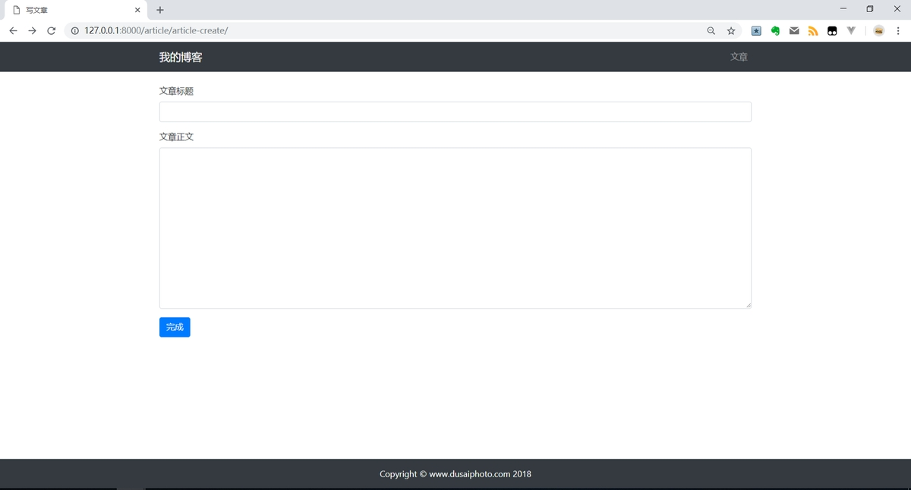
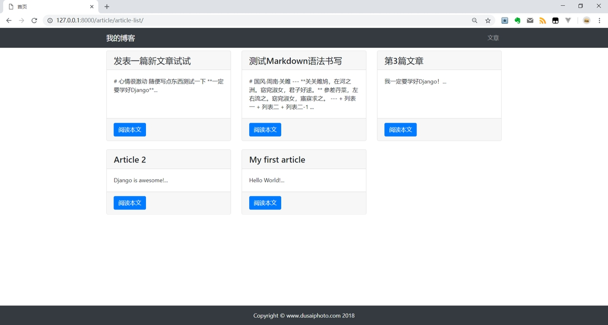
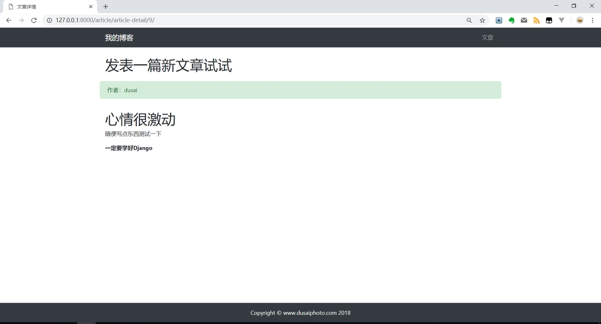
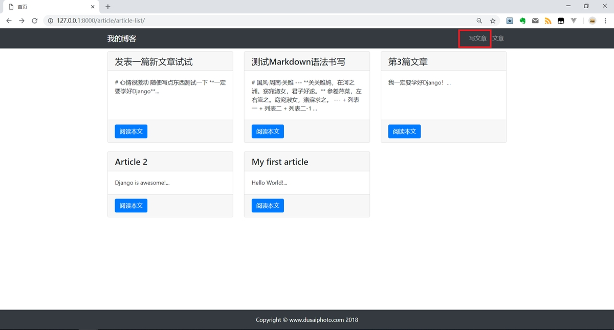

前面我们已经学会如何用Markdown语法书写文章了。

但是还有问题呀。之前写文章都是在后台中进行的，**万一有别的普通用户也要发表文章怎么办？万一我想拓展些后台中没有的提交验证功能又怎么办？**

本章即讲述如何在前台中提交新的文章，以便满足开发者各种各样的*特殊需求*。

## Forms表单类

**在HTML中，表单是在 `<form>...</form>` 中的一些元素**，它允许访客做类似输入文本、选择选项、操作对象或空间等动作，然后发送这些信息到服务端。一些表单界面元素（文本框或复选框）非常简单并内置在HTML中，而其他会复杂些：像弹出日期选择等操作控件。

处理表单是一件挺复杂的事情。想想看Django的admin，许多不同类型的数据可能需要在一张表单中准备显示，渲染成HTML，使用方便的界面进行编辑，传到服务器，验证和清理数据，然后保存或跳过进行下一步处理。

Django的表单功能可以简化上述工作的大部分内容，并且也能比大多数程序员自己编写代码去实现来的更安全。

**Django表单系统的核心组件是 `Form`类**，它能够描述一张表单并决定它如何工作及呈现。

要使用`Form`类也很简单，需要在`article/`中创建`forms.py`文件，并写入如下代码：

```python
article/forms.py

# 引入表单类
from django import forms
# 引入文章模型
from .models import ArticlePost

# 写文章的表单类
class ArticlePostForm(forms.ModelForm):
    class Meta:
        # 指明数据模型来源
        model = ArticlePost
        # 定义表单包含的字段
        fields = ('title', 'body')
```

代码中`ArticlePostForm`类继承了Django的表单类`forms.ModelForm`，并在类中定义了内部类`class Meta`（之前提到过，[还记得吗](https://www.dusaiphoto.com/article/article-detail/11/)），指明了数据模型的来源，以及表单中应该包含数据模型的哪些字段。

在`ArticlePost`模型中，`created`和`updated`字段为自动生成，不需要填入；`author`字段暂时固定为id=1的管理员用户，也不用填入；剩下的`title`和`body`就是表单需要填入的内容了。

接下来，改写`article/views.py`，添加一个视图函数以处理写文章的请求：

```python
article/views.py

...

# 引入redirect重定向模块
from django.shortcuts import render, redirect
# 引入HttpResponse
from django.http import HttpResponse
# 引入刚才定义的ArticlePostForm表单类
from .forms import ArticlePostForm
# 引入User模型
from django.contrib.auth.models import User

...

# 写文章的视图
def article_create(request):
    # 判断用户是否提交数据
    if request.method == "POST":
        # 将提交的数据赋值到表单实例中
        article_post_form = ArticlePostForm(data=request.POST)
        # 判断提交的数据是否满足模型的要求
        if article_post_form.is_valid():
            # 保存数据，但暂时不提交到数据库中
            new_article = article_post_form.save(commit=False)
            # 指定数据库中 id=1 的用户为作者
            # 如果你进行过删除数据表的操作，可能会找不到id=1的用户
            # 此时请重新创建用户，并传入此用户的id
            new_article.author = User.objects.get(id=1)
            # 将新文章保存到数据库中
            new_article.save()
            # 完成后返回到文章列表
            return redirect("article:article_list")
        # 如果数据不合法，返回错误信息
        else:
            return HttpResponse("表单内容有误，请重新填写。")
    # 如果用户请求获取数据
    else:
        # 创建表单类实例
        article_post_form = ArticlePostForm()
        # 赋值上下文
        context = { 'article_post_form': article_post_form }
        # 返回模板
        return render(request, 'article/create.html', context)
```

分析一下上面的代码。当视图函数接收到一个客户端的`request`请求时，首先根据`request.method`判断用户是要**提交数据（POST）、还是要获取数据（GET）**：

- 如果用户是**提交数据**，将POST给服务器的表单数据赋于`article_post_form`实例。然后使用Django内置的方法`.is_valid()`判断提交的数据是否满足模型的要求。

  - 如果**满足要求**，保存表单中的数据（但是`commit=False`暂时不提交到数据库，因为`author`还未指定），并指定`author`为id=1的管理员用户。然后提交到数据库，并通过`redirect`返回文章列表。`redirect`可通过url地址的名字，反向解析到对应的url。

  - 如果**不满足要求**，则返回一个字符串**"表单内容有误，请重新填写。"**，告诉用户出现了什么问题。

- 如果用户是**获取数据**，则返回一个空的表单类对象，提供给用户填写。

其实逻辑并不复杂，不明白的读者请逐句理解。

Django官方文档对Form类做了详细的说明：

`Form`实例可以**绑定**到数据，也可以**不绑定**数据。

- 如果**绑定**到数据，就能够验证该数据并将表单呈现为HTML并显示数据。
- 如果它**未绑定**，则无法进行验证（因为没有要验证的数据！），但仍然可以将空白表单呈现为HTML。

要将数据绑定到表单，就将数据作为字典作为第一个参数传递给`Form`类构造函数：

```json
>>> data = {'subject': 'hello',
...         'message': 'Hi there',
...         'sender': 'foo@example.com',
...         'cc_myself': True}
>>> f = ContactForm(data)
```

`Form`对象的主要任务是验证数据。使用绑定后的 `Form`实例，调用`is_valid()`方法验证并返回指定数据是否有效的布尔值：

```json
>>> data = {'subject': 'hello',
...         'message': 'Hi there',
...         'sender': 'foo@example.com',
...         'cc_myself': True}
>>> f = ContactForm(data)
>>> f.is_valid()
True
```

让我们尝试一些无效的数据。`subject`为空（错误，因为默认情况下需要所有字段），并且`sender`不是有效的电子邮件地址:

```json
>>> data = {'subject': '',
...         'message': 'Hi there',
...         'sender': 'invalid email address',
...         'cc_myself': True}
>>> f = ContactForm(data)
>>> f.is_valid()
False
```

关于Forms类的详细解释看这里：[The Forms API](https://docs.djangoproject.com/zh-hans/2.1/ref/forms/api/)

**这里特别提醒Django中的缩进不能够空格和tab键混用，否则会报错。**由于不同的编辑器对tab的显示不尽相同，因此你应该坚持使用空格键缩进。

> 大多数文本编辑器可以自动将tab转换为空格，请合理设置。

写好视图之后，就需要写模板文件了。在`templates/article/`中创建`create.html`：

```html
templates/article/create.html

<!-- extends表明此页面继承自 base.html 文件 -->
 
<!-- 写入 base.html 中定义的 title -->
 写文章 
<!-- 写入 base.html 中定义的 content -->

<!-- 写文章表单 -->
<div class="container">
    <div class="row">
        <div class="col-12">
            <br>
            <!-- 提交文章的表单 -->
            <form method="post" action=".">
                <!-- Django中需要POST数据的地方都必须有csrf_token -->
                
                <!-- 文章标题 -->
                <div class="form-group">
                    <!-- 标签 -->
                    <label for="title">文章标题</label>
                    <!-- 文本框 -->
                    <input type="text" class="form-control" id="title" name="title">
                </div>
                <!-- 文章正文 -->
                <div class="form-group">
                    <label for="body">文章正文</label>
                    <!-- 文本区域 -->
                    <textarea type="text" class="form-control" id="body" name="body" rows="12"></textarea>
                </div>
                <!-- 提交按钮 -->
                <button type="submit" class="btn btn-primary">完成</button>
            </form>
        </div>
    </div>
</div>

```

html文件还是一如既往的长。**再重复一次，看不懂html文件语法也没有关系，先照着抄一遍，以后再慢慢理解，不影响目前Django的学习。**

对其中的新内容进行审视：

- `<form>..</form>`标签中的内容就是需要提交的表单。`method="post"`指定了表单提交的方式为POST（与视图函数中的`request.method`相联系）；`action="."`指定了表单提交的地址为默认的当前url。

- 关于``，它是Django中一个与网络安全相关的中间件验证。目前我们暂时不去深究它的实现，**只需要知道表单中必须包含它就可以了**，否则将会得到一个403错误。

- `<input>`和`<textarea>`标签中的`name=''`属性指定了当前文本框提交的数据的名称，它必须与表单类中的字段名称对应，否则服务器无法将字段和数据正确的对应起来。

最后老规矩，在`article/urls.py`中增加一个写文章的url地址：

```python
article/urls.py

urlpatterns = [
    ...
    
    # 写文章
    path('article-create/', views.article_create, name='article_create'),
]
```

大功告成了，不要着急，先喝口水，万一有bug又得忙活半天了。**如果报错也不要慌张，开发过程一定是曲折的，耐心看看Django给出的错误提示，线索就在其中。**

保存修改并运行服务器，地址栏中输入：`http://127.0.0.1:8000/article/article-create/`，看到如下界面：



很好，似乎正常工作起来了。接着随便输入些[Markdown语法的文章](https://www.dusaiphoto.com/article/article-detail/20/)，测试功能是否正常：


点击**完成**按钮后，页面会回到文章列表：



刚才提交的文章神奇的出现在列表中了。

点击**阅读本文**按钮，进入文章详情页面：



出现了具有**Markdown**语法的优美的文章。

是不是非常有成就感呢？

别激动，还有一些收尾工作需要做。

## 优化写文章入口

与之前类似，我们需要在导航栏中设置一个**写文章**的入口，优化使用体验。

将下列代码加入到`templates/header.html`中：

```html
<li class="nav-item">
    <a class="nav-link" href="">写文章</a>
</li>
```

读者是否清楚，上面的代码应该放置在什么位置呢？

保存后刷新浏览器界面，**导航栏**有了如下变化：



点击**写文章**按钮，就可以进入写新文章的页面了，从此再也不用手动输入繁琐的url地址了。

世界是多么的美好。

## 总结

本章学习了使用Django的表单类，完成了提交新文章的基本功能。当然目前暂时还没有真正将文章和登录的用户关联起来；等到学习了用户管理的知识，再回头来处理这部分的内容。

下一章继续学习如何删除一篇文章。

- 有疑问请在[杜赛的个人网站](http://www.dusaiphoto.com)留言，我会尽快回复。
- 或Email私信我：dusaiphoto@foxmail.com
- 项目完整代码：[Django_blog_tutorial](https://github.com/stacklens/django_blog_tutorial)
