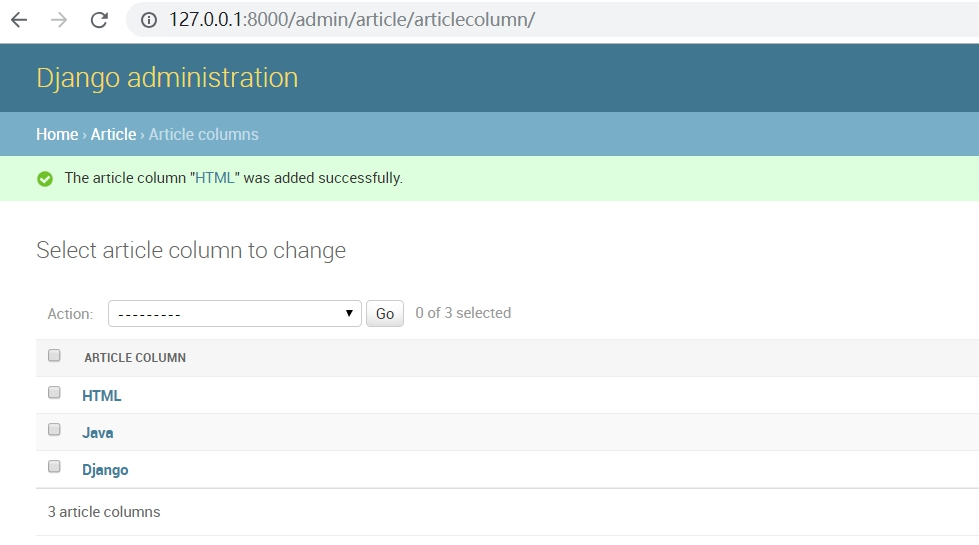
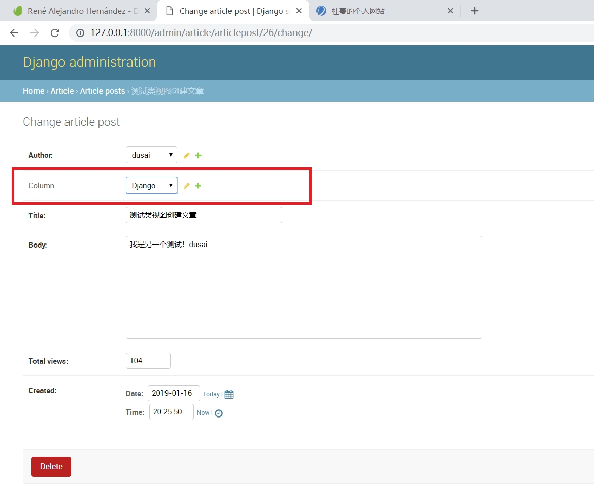
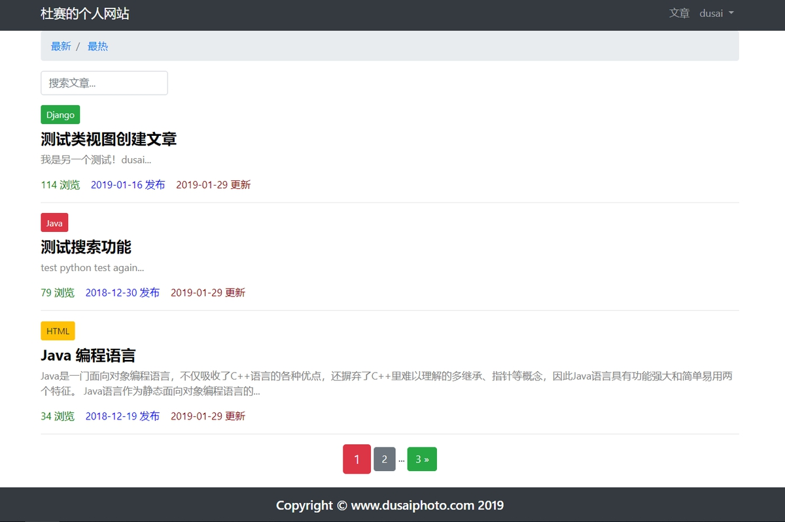
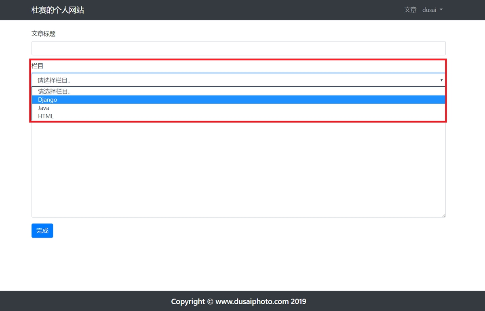

博客的文章类型通常不止一种：有时候你会写高深莫测的技术文章，有时候又纯粹只记录一下当天的心情。

因此**对文章的分类**就显得相当的重要了，既方便博主对文章进行分类归档，也方便用户有针对性的阅读。

而文章分类一个重要的途径就是设置**栏目**。

## 栏目的模型

实现文章栏目功能的方法有多种。你可以只是简单的在文章的Model中增加`CharField()`字段，以字符串的形式将栏目名称保存起来（实际上这种实现更像是**“标签”**，以后会讲到）。这样做的优点是比较简单；缺点也很明显，就是时间长了你可能会记混栏目的名字，并且也不方便对栏目的其他属性进行扩展。

因此对文章栏目可以独立为一个Model，用外键与文章的Model关联起来。

修改`article/modles.py`文件：

```python
article/models.py

...

class ArticleColumn(models.Model):
    """
    栏目的 Model
    """
    # 栏目标题
    title = models.CharField(max_length=100, blank=True)
    # 创建时间
    created = models.DateTimeField(default=timezone.now)

    def __str__(self):
        return self.title


class ArticlePost(models.Model):
    ...

    # 文章栏目的 “一对多” 外键
    column = models.ForeignKey(
        ArticleColumn,
        null=True,
        blank=True,
        on_delete=models.CASCADE,
        related_name='article'
    )
    
    ...

```

栏目的Model有两个字段，“名称”和“创建日期”。

一篇文章只有一个栏目，而一个栏目可以对应多篇文章，因此建立“一对多”的关系。

写好模型后记得用`makemigrations`和`migrate`指令**迁移数据**。

## 列表中显示栏目

### 添加测试数据

模型写好之后就需要几条栏目的数据来进行测试。由于还没有写视图，因此需要善加利用Django自带的后台。

首先把栏目模型注册到后台：

```python
article/admin.py

...

from .models import ArticleColumn

# 注册文章栏目
admin.site.register(ArticleColumn)
```

然后就可以在后台中添加栏目的数据条目了：



先随便添加了“HTML”、“Java”、“Django”这3条。

在后台中随便打开一篇文章，“栏目”字段已经静静的在等你了：



随机找几篇文章设置不同的**栏目**用于测试。

### 重写文章列表

之前我们用**卡片类型**的UI界面展示文章列表。

卡片的好处是简洁大方，但是**随着数据的增多**，卡片小小的版面已经不堪重负了。

因此这里重写`list.html`模板的列表循环：

```html
article/list.html

...

<!-- 列表循环 -->
<div class="row mt-2">
    
        <!-- 文章内容 -->
        <div class="col-12">
            <!-- 栏目 -->
            
                <button type="button" 
                    class="btn btn-sm mb-2
                        
                            btn-success
                        
                            btn-danger
                        
                            btn-warning
                        
                    "
                >
                    {{ article.column }}
                </button>
            
            <!-- 标题 -->
            <h4>
                <b>
                    <a href=""
                       style="color: black;" 
                    >
                        {{ article.title }}
                    </a>
                </b>
            </h4>
            <!-- 摘要 -->
            <div>
                <p style="color: gray;">
                    {{ article.body|slice:'100' }}...
                </p>
            </div>
            <!-- 注脚 -->
            <p>
                <!-- 附加信息 -->
                <span style="color: green;">
                    {{ article.total_views }} 浏览&nbsp;&nbsp;&nbsp;
                </span>
                <span style="color: blue;">
                    {{ article.created|date:'Y-m-d' }} 发布&nbsp;&nbsp;&nbsp;
                </span>
                <span style="color: darkred;">
                    {{ article.updated|date:'Y-m-d' }} 更新
                </span>
            </p>
            <hr>
        </div>
    
</div>

...
```

最主要的改动就是新增了展现“栏目”的按钮。我们甚至还为不同的栏目设置了不同的按钮颜色。

在附加信息中顺便还把之前没有用到的日期信息也添加上去了。

来看看效果：



感觉还不错！

## 修改写文章功能

展示已经没问题了，但是发表新文章时还不能选择栏目。

修改写文章的模板，在表单中新增下面的内容：

```html
templates/article/create.html

...

<!-- 提交文章的表单 -->
<form method="post" action=".">
    
    <!-- 文章标题 -->
    ...
    
    <!-- 文章栏目 -->
    <div class="form-group">
        <label for="column">栏目</label>
        <select class="form-control" 
                id="column" 
                name="column"
        >
                <option value="none">请选择栏目..</option>
            
                <option value="{{ column.id }}">{{ column }}</option>
            
        </select>
    </div>

    <!-- 文章正文 -->
    ...
    <!-- 提交按钮 -->
    ...
</form>
```

`<select>`是表单的下拉框选择组件。在这个组件中循环列出所有的栏目数据，并且设置`value`属性，指定表单提交栏目的`id`值。

刷新页面，效果像下面这样：



跟之前一样，能够展示了，但是还没有处理表单的视图逻辑。

修改已有的写文章视图`article_create()`，让其能够处理表单上传的栏目数据：

```python
article/views.py

# 引入栏目Model
from .models import ArticleColumn

...

# 写文章的视图
...
def article_create(request):
    if request.method == "POST":
        ...
        if article_post_form.is_valid():
            ...
            
            # 新增的代码
            if request.POST['column'] != 'none':
                new_article.column = ArticleColumn.objects.get(id=request.POST['column'])
            
            # 已有代码
            new_article.save()
            ...
    else:
        ...
        
        # 新增及修改的代码
        columns = ArticleColumn.objects.all()
        context = { 'article_post_form': article_post_form, 'columns': columns }
        
        ...
```

新增代码涉及`get`和`post`两部分：

- POST：主要考虑某些文章是可以没有栏目的。因此用`if`语句判断该文章是否有栏目，如果有，则根据表单提交的`value`值，关联对应的栏目。
- GET：增加栏目的上下文，以便模板使用。

测试一下，写文章的栏目功能应该可以正常工作了。

## 修改更新视图

更新文章的视图同样也需要升级一下。

还是先更改模板：

```html
templates/article/update.html

...

<!-- 提交文章的表单 -->
<form method="post" action=".">
    

    <!-- 文章标题 -->
    ...

    <!-- 文章栏目 -->
    <div class="form-group">
        <label for="column">栏目</label>
        <select class="form-control" 
                id="column" 
                name="column"
        >
                <option value="none">请选择栏目..</option>
            
                <option value="{{ column.id }}"
                    
                        selected
                    
                >
                    {{ column }}
                </option>
            
        </select>
    </div>

    <!-- 文章正文 -->
    ...

    <!-- 提交按钮 -->
    ...
</form>

...
```

与前面稍有不同的是，表单中判断了`column.id`与`article.column.id`是否相等，如果相等则将其设置为默认值。

然后修改视图函数：

```python
article/views.py

# 更新文章
...
def article_update(request, id):
    ...

    # 判断用户是否为 POST 提交表单数据
    if request.method == "POST":
        ...
        if article_post_form.is_valid():
            ...

            # 新增的代码
            if request.POST['column'] != 'none':
                article.column = ArticleColumn.objects.get(id=request.POST['column'])
            else:
                article.column = None

            ...

    else:
        ...

        # 新增及修改的代码
        columns = ArticleColumn.objects.all()
        context = { 
            'article': article, 
            'article_post_form': article_post_form,
            'columns': columns,
        }

        ...
```

代码逻辑与前面很类似。修改文章的栏目功能，也就完成了。

## 总结

本章实现了简单的**栏目功能**，可以舒舒服服对文章进行分类了，强迫症福音啊。

还有些可以完善的工作，比如：

- 单击**栏目按钮**显示所有相同栏目的文章。这个功能与之前学过的[最热文章排序](https://www.dusaiphoto.com/article/detail/46/)以及[搜索文章](https://www.dusaiphoto.com/article/detail/47/)非常的类似。还记得`filter()`方法吗？稍微麻烦点的地方是你需要考虑栏目、搜索、排序三者的联合查询，因此可能会对原有代码结构做适当的调整。

  > **实在不知道如何去实现的同学，请查看[教程代码](https://github.com/stacklens/django_blog_tutorial)文章列表的视图和模板，答案就在里面。**

- 栏目Model的增删改查。

  > 如果你不想写增删改查，用后台管理栏目是完全可以的。

以上内容就不在这里赘述了。留给读者去尝试实现。

- 有疑问请在[杜赛的个人网站](http://www.dusaiphoto.com)留言，我会尽快回复。
- 或Email私信我：dusaiphoto@foxmail.com
- 项目完整代码：[Django_blog_tutorial](https://github.com/stacklens/django_blog_tutorial)