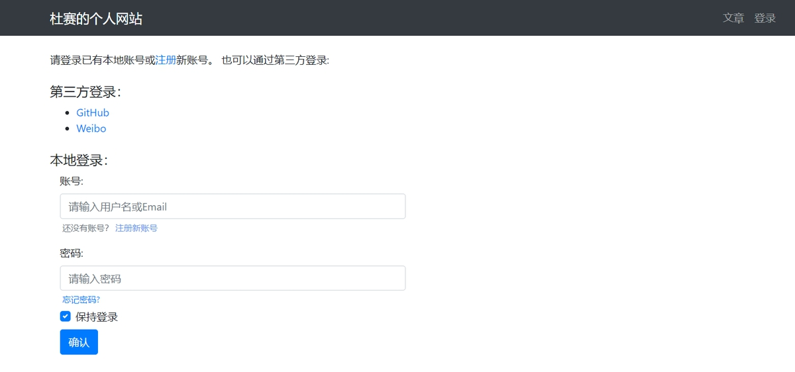
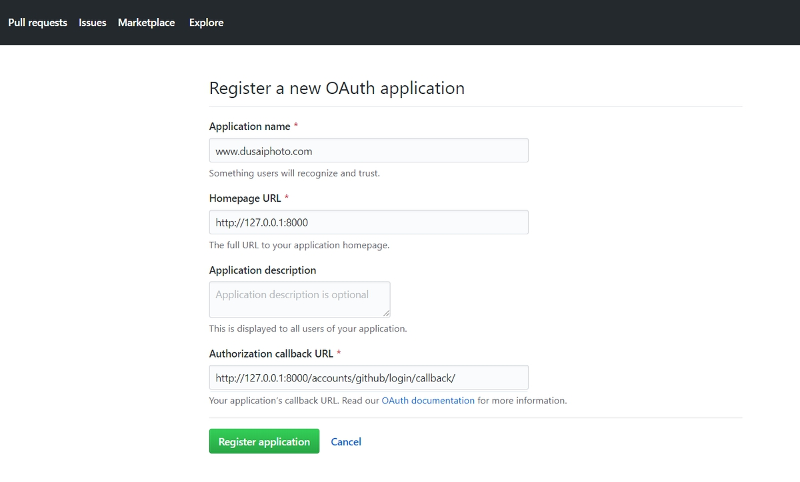
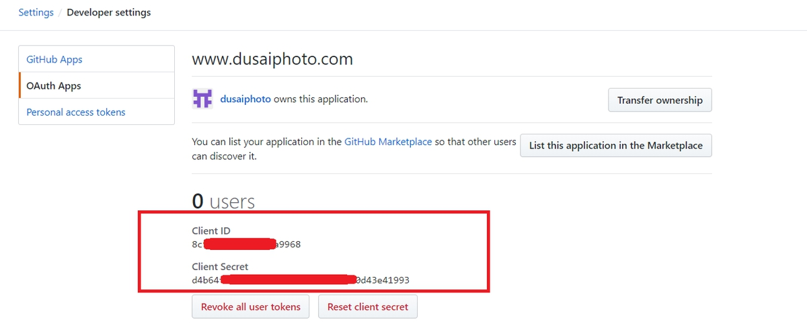
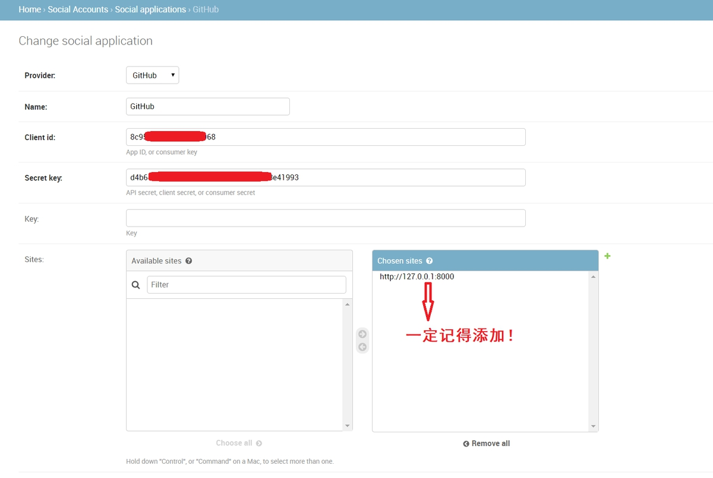
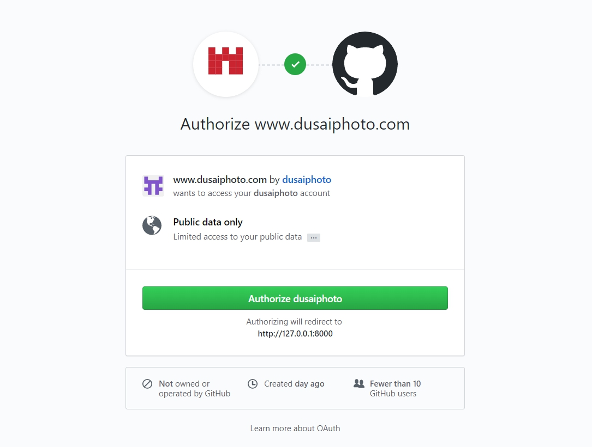

现在我们已经拥有一个可以进行用户**本地登录**的博客系统了。如果有人欣赏你的文章，说不定就会注册成为本地用户，并和你好好交流一番。

但头疼的是，用户可能每天都在互联网上浏览很多非常棒的博客，如果每个博客都要去注册才能评论，对用户是个不小的负担。对个人博客这类草根网站，说不定用户就懒得去注册了，你也就损失了一个潜在的”粉丝“。

比较流行的解决方案是允许用户通过**第三方登录**，即可以通过GitHub、微博这类知名社区的授权，从而登录你的小站，免去了注册的麻烦。

本章会介绍一个强大的库：`Django-allauth`，它不仅包含一整套的本地注册、登录、管理的解决方案，还支持GitHub、Twitter、微博、微信甚至百度等几十种第三方登录方式，真的是当爹又当妈啊...

## 本地登录

先看看`django-allauth`的本地登录如何配置。

安装`django-allauth`：

```bash
(env) > pip install django-allauth
```

修改配置文件：

```python
my_blog/settings.py

...


TEMPLATES = [
    {
        ...
        'OPTIONS': {
            'context_processors': [
                # allauth 启动必须项
                'django.template.context_processors.request',
            ],
        },
    },
]


AUTHENTICATION_BACKENDS = (
    # Django 后台可独立于 allauth 登录
    'django.contrib.auth.backends.ModelBackend',

    # 配置 allauth 独有的认证方法，如 email 登录
    'allauth.account.auth_backends.AuthenticationBackend',
)


INSTALLED_APPS = [
    ...
    # allauth 启动必须项
    'django.contrib.auth',
    'django.contrib.messages',
    'django.contrib.sites',

    'allauth',
    'allauth.account',
    'allauth.socialaccount',
    
    # 可添加需要的第三方登录
    'allauth.socialaccount.providers.github',
    'allauth.socialaccount.providers.weibo',
    ...
]

# 设置站点
SITE_ID = 1

# 登录成功后重定向地址
LOGIN_REDIRECT_URL = '/article/article-list'

...
```

注意上面的配置中，有的内容是创建项目时本来就有的，检查一下你的项目中是否包含；有的内容是完全新增的，不要漏掉了。

`django-allauth`也是一个app，因此需要分配给它`url`：

```python
my_blog/urls.py

...

urlpatterns = [
    ...
    path('accounts/', include('allauth.urls')),
    ...
]
```

最后一步是迁移数据：

```bash
(env) > python manage.py migrate
```

这就完成了！

输入`django-allauth`的默认登录页面地址：

```html
http://127.0.0.1:8000/accounts/login/
```

显示页面如下：


### 设置网站首页

教程到现在，我们的博客都还没有分配首页地址。

博客网站的首页通常就是文章列表本身，因此把这个路由添加到`my_blog/urls.py`中：

```python
my_blog/urls.py

...
from article.views import article_list

urlpatterns = [
    # home
    path('', article_list, name='home'),
    ...
]
...
```

再把登录成功后的重定向地址改过来：

```python
my_blog/settings.py

...
# 重定向 url
#LOGIN_REDIRECT_URL = '/article/article-list'
LOGIN_REDIRECT_URL = '/'

```

这样就拥有地址为`http://127.0.0.1:8000`首页啦。

### 美化模板

`django-allauth`自带的模板是简陋的，需要覆写为自己网站的风格才能使用。

还记得我们一直在使用的**虚拟环境**吗？没错，所有项目运行所需的第三方库都是保存在虚拟环境的文件夹中的，在本教程中也就是`env`文件夹了。找到下面的路径：

```bash
env\Lib\site-packages\allauth\templates\account\login.html
```

这个`login.html`就是原始的登录模板文件了。虽然可以直接修改这个文件来优化页面，但是这样做是很蠢的，因为每当你升级库、或者换台电脑部署时，模板又恢复回去了。

正确的做法是**复制**这个`login.html`到你自己项目的`templates`文件夹中去。即你需要在项目中创建一个**完全相同的路径**：

```html
templates\account\login.html
```

>  Django会优先在项目中寻找模板文件，因此只要相对路径相同，则可以达到覆写的目的。

接下来就可以愉快的定制风格了。

参考代码如下：

```html
templates\account\login.html





登录


<div class="container">
    <div class="row">
        <div class="col-12">
            <br>
            
            
            <p>
                请登录已有本地账号或<a href="{{ signup_url }}">注册</a>新账号。
                也可以通过第三方登录:
            </p>

            <div class="socialaccount_ballot">
                <h5 class="mb-2 mt-4">第三方登录：</h5>
                <ul class="socialaccount_providers">
                  
                </ul>
                <h5 class="mb-2 mt-4">本地登录：</h5>
            </div>

            

            
            <p>If you have not created an account yet, then please
            <a href="{{ signup_url }}">sign up</a> first.</p>
            
            <div class="col-6">
                <form class="login" id="login_form" method="POST" action="">
                    
                    <div class="form-group">
                        <label for="id_login">账号: </label>
                        <input type="text" name="login" placeholder="请输入用户名或Email" autofocus="autofocus" required
                            id="id_login" class="form-control" />
                        <small class="form-text text-muted ml-1">
                            还没有账号？
                            <a href="" style="color: cornflowerblue; ">
                                注册新账号
                            </a>
                        </small>
                    </div>
                    <div class="form-group mb-1">
                        <label for="id_password">
                            密码:
                        </label>
                        <input type="password" name="password" placeholder="请输入密码" required id="id_password"
                            class="form-control" />
                        <small class="form-text text-muted ml-1">
                            <a class="secondaryAction layui-text" href="">
                                忘记密码?
                            </a>
                        </small>
                    </div>
                    <div class="custom-control custom-checkbox mb-2">
                        <input type="checkbox" name="remember" id="id_remember" checked class="custom-control-input" />
                        <label for="id_remember" class="custom-control-label">
                            保持登录
                        </label>
                    </div>
                    <button class="primaryAction btn btn-primary" type="submit" id="submit_login">确认</button>
                </form>
            </div>
        </div>
    </div>
</div>

```

实际效果如下：



除了登录页面以外，其他的所有页面，如注册、邮箱认证页面及邮件、第三方登录页面等都可以用这种方法进行覆写。教程中就不再赘述，读者请自行尝试。

### 注册

接下来看看注册页面。

点击注册按钮，则看到如下页面：


需要注意的是**邮箱**这一项如果你填了，那么站点会自动向填写的邮箱发送认证邮件。因此前面章节中讲过的关于邮箱的配置一定要正确，否则就会得到一个`ConnectionRefusedError`的错误。相关的配置项如下：

```python
my_blog/settings.py

# SMTP服务器
EMAIL_HOST = 'your smtp'
# 邮箱名
EMAIL_HOST_USER = 'your email'
# 邮箱密码
EMAIL_HOST_PASSWORD = 'your password'
# 发送邮件的端口
EMAIL_PORT = 25
# 是否使用 TLS
EMAIL_USE_TLS = True
# 默认的发件人
DEFAULT_FROM_EMAIL = 'your email'
```

记得修改为你自己的邮箱配置。

另外需要注意的是`django-allauth`所注册的账号与`django`内置的本地账号是通用的，也就是说通过内置`User`创建的账号，是可以通过`django-allauth`登录的。

> 有了django-allauth，之前教程中写的用户登录、注册以及密码重置模块统统都可以不要了。那既然如此，博主绕了这么大个弯不是坑人吗？这个嘛，学习就是要变着法折腾..

## GitHub登录

搞定了本地登录，接下来的第三方登录才是重点。

由于**GitHub**的第三方登录是最容易的，因此作为例子来讲解。

> 作为合格的程序员，怎么能没有GitHub账号！

### GitHub注册OAuth

创建第三方登录的第一步，是需要在GitHub网站上创建OAuth应用。登录GitHub账号，然后进入地址：

```bash
https://github.com/settings/applications/new
```

不排除以后这个地址会变，如果不对就麻烦读者在个人主页的`settings`里找一找`OAuth`的设置了。

进入页面后，填写一下内容：



填写的是本地IP，以后部署在线上再修改成实际的域名。

注意`callback URL`填写的内容。点击确定后，就得到了应用的信息：



其中的`Client ID`和`Client Secret`就是要用到的凭证。

### Django后台配置

然后对Django后台进行设置。

进入后台，你会发现多了几个栏目：


打开`Sites`，将`example.com`修改为博客域名。开发时则修改为本地IP：


然后进入`Social applications`，添加一条`applications`如下：



注意最下面的`Sites`栏**一定要把刚才添加的站点选择到右边去**。

回到`django-allauth`的登录页面，点击`github`登录：



实现了GitHub登录。

## allauth配置项

**挑几个比较重要的讲一下。**

`ACCOUNT_EMAIL_VERIFICATION = 'optional' / 'mandatory' / 'none'`：当其为`mandatory`时，本地注册的用户必须先验证邮箱才可以登录。`optional`和`none`都不要求验证邮箱，区别是`optional`仍然会发送验证邮件，而`none`连认证邮件都不会发送。

`SOCIALACCOUNT_EMAIL_VERIFICATION = 'optional' / 'mandatory' / 'none'`：同理，但是作用于第三方账号的注册。

`ACCOUNT_AUTHENTICATION_METHOD = 'username_email' / 'user' / 'email'`：指定登录方法，即通过用户名、邮箱进行登录，或者两者均可。

`ACCOUNT_EMAIL_REQUIRED =  True / False`：注册本地用户时，是否必须填写邮箱。

除此之外还有很多配置项，详细了解请查阅[官方文档](<https://django-allauth.readthedocs.io/en/latest/configuration.html>)。

## 总结

本章学习了通过`django-allauth`实现本地及GitHub登录的功能。微博、微信的登录方式大致都遵循这个流程；本章虽然加载了微博的接口，但是限于篇幅并没有配置，请读者查阅官方文档去实现。需要注意的是国内的第三方登录多半需要一两天时间去申请、审核，要更加麻烦一些。

另外还剩下写入口、删除旧功能等收尾工作，就交给读者自己去完成了。

> 提示一下，登录的逆向解析地址为``，注册为``。这些在原始模板文件或官方网站都能查到。

------

- 有疑问请在[杜赛的个人网站](http://www.dusaiphoto.com)留言，我会尽快回复。
- 或Email私信我：dusaiphoto@foxmail.com
- 项目完整代码：[Django_blog_tutorial](https://github.com/stacklens/django_blog_tutorial)