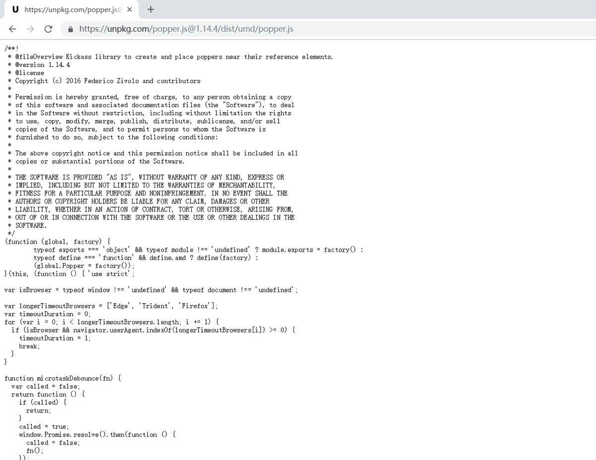
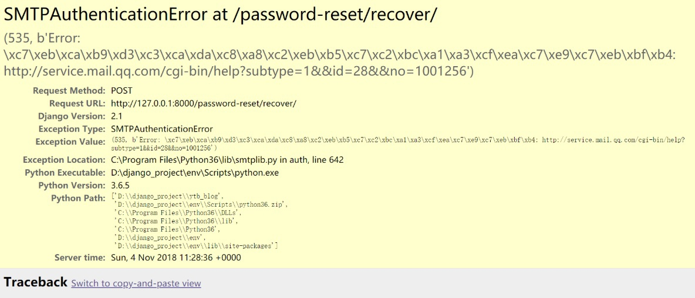
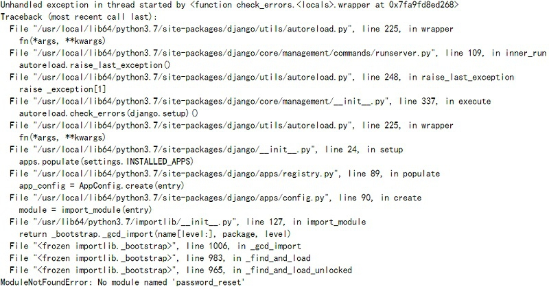

**本帖集中回答读者的提问，解决其他读者重复出现的问题。**

大部分的读者提问我都整合到教程中合适的地方去了。有些不合适在教程中出现的会放在这里。

和读者的交流会尽量精简，并且不会出现姓名、联系方式等。

本帖持续更新。

## 代码问题

**读者：博主你的网站挺漂亮的，能否公布源码？**

源码在GitHub上公开的，在我的主页就能找到。

但是请注意，它并不是一个面向大众的项目，所以功能并不完善，其他人用起来会有很多坑。

因此非常不建议读者下载使用。

**读者：怎样给网站设置url为`www.xxx.com`的首页地址？首页可以使用`namespace`来避免硬编码吗？**

`namespace`的定义为“实例命名空间”，它的主要作用是反向解析地址时，确定请求的url到底处于哪个实例当中；也可以简单理解为在哪个app中。

而每个app自己的`urls.py`的地址里，我们注明的`name`是“应用命名空间”，它是url最底层的反向解析名称，指向具体的url地址。

我们在模板中调用``时，django会在`article`这个app中去寻找`name='index'`的url。

因为网站首页`index.html`可以不属于任何一个app（它是所有app的入口），所以不用赋予`namespace`实例命名空间，直接在项目根url中赋值`name`就可以了，像这样：

```python
your_project/urls.py
...

urlpatterns = [
    ...
    path('', your_view, name='index'),
]
```

在模板中像这样调用：

```html

```

同样可以避免硬编码，实现url反向解析。

更加深入详细的解释看官网：[url_dispatcher](https://docs.djangoproject.com/en/2.1/topics/http/urls/)

## Markdown相关问题

**读者：我无论如何调试，代码高亮都无法正常显示。**

代码高亮这里遇到问题的人比较多，因此我在教程中更新了如何去排查问题。

详见这里：[使用Markdown语法](https://www.dusaiphoto.com/article/article-detail/20/)

------

**读者：Markdown语法中，代码块一定要标识编程语言吗？**

确实有读者没有标注编程语言，导致无法正确显示高亮。虽然很多Markdown编辑器都不要求一定要标识，但是我建议你还是标识吧，反正也没有什么坏处。

------

**读者：Markdown语法我不熟悉，有没有能够实时预览效果的编辑器？**

有的，我的个人网站用的这个：[editor.md](https://github.com/pandao/editor.md)，功能很强大，虽然作者已经很久没更新了。

另外就我个人来讲，我觉得在线的实时预览其实用处并不大，甚至我都想把我博客的editor.md给废弃掉了，因为它和LayUI有一些样式上的冲突。

还有一个原因是我习惯先在本地把文章编辑好，再上传到web。本地的Markdown编辑器我用的[Typora](https://typora.io/)，免费，单屏实时渲染，非常非常推荐。

## 环境配置问题

**读者：请问教程里的popper.js该如何下载，我没找到任何可以下载的地方。**

下载页面是这个：`https://unpkg.com/popper.js@1.14.4/dist/umd/popper.js`

点进去后是一个全是JavaScript代码的页面：



新建一个空的JS文件`xxx.js`，把整个页面拷贝进去就可以了。当然我提供的链接下载的是1.14.4非压缩版本的，其他版本请去官网找找：[Popper.js](https://popper.js.org/)

---

**读者：为什么我的项目无法通过Email重置密码？**



注意看报错中的：`Exception Value:SMTPAuthenticationError`

说明邮件发送代理没有通过验证。这种情况很可能是你在`settings.py`中与Email相关的设置出错了，特别是账户、密码、SMTP服务器等设置。

---

**读者：我想用Django搭建一个前后端分离的项目。**

对于还在看我这篇教程的同学，强烈建议你先掌握好Django的MTV框架的基础，再去捣鼓前后端分离这类现代的web开发模式。这样学习的曲线比较平滑，以免有挫折感。

如果你实在不想从基础学起，那我就推荐你：

- 先学习[django-rest-framework](https://www.django-rest-framework.org/)，这是一个基于Django的、强大的构建后端API的框架。
- 然后学习三大前端框架[angular](https://angular.io/)、[react](https://reactjs.org/)、[vue](https://cn.vuejs.org/index.html)其中的一个。
- 最后再把前后端连接起来

------

**读者：请问password-reset这个是Django自带的函数吗，还是需要用pip安装？**

用`pip`安装

------

**读者：安装完`password_reset`后，我的项目代码不停报错。**



注意看最后一行报错信息：没有找到这个库。重新安装吧。

## 心理咨询

**读者：我研究生了，想转行当程序员，是不是太晚了？**

不晚，我都研究生毕业、工作4年了，这才开始学编程。我都不怕，你怕啥。

- 如果你学习的唯一目的是找工作，那就抓紧一切时间学Java、JavaScript这种热门语言
- 如果学编程只是出于兴趣，那就找感兴趣的学，莫问前程

---

**读者：学Python找工作前景如何？**

某些方向还可以，比如人工智能、爬虫、数据分析、运维等。

但是因为这几年是个人都在学Python，所以如果你只学点皮毛肯定是不行的。

总体来说并不是很乐观，零基础的同学，找工作建议你还是学Java、JavaScript吧，需求量大。

---

**读者：你这注释写得完全没啥意义啊。**

我的教程是写给纯新手的，同时还是个野路子，初级以上程序员请略过吧。感谢那些替我勘误的读者。

---

**读者：为啥你的网站上啥都有，蛮厉害的，你到底是干啥的。**

在成都某国企混饭的底层职工。

---

**读者：老哥你玩dota不？混帝吧不？炒股不？...**

额...

---

- 有疑问请在[杜赛的个人网站](http://www.dusaiphoto.com)留言，我会尽快回复。
- 或Email私信我：dusaiphoto@foxmail.com
- 项目完整代码：[Django_blog_tutorial](https://github.com/stacklens/django_blog_tutorial)
